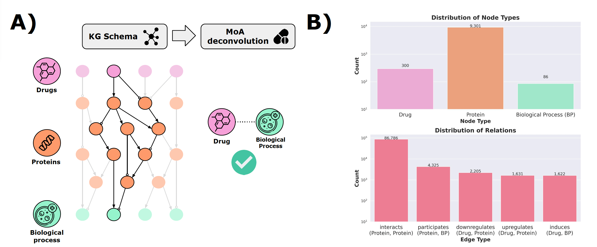

<h1 align="center">
Mechanism-of-Action Retrieval System (MARS)
<br>

[]()

[](https://img.shields.io/badge/python-%3E%3D3.8-brightgreen)

</h1>

This repository accompanies the source code and data relevant for the the paper titled **"MARS: A neurosymbolic approach for interpretable drug discovery"**.

**MARS** is an acrynonym for **m**echanism-of-**a**ction **r**etrieval **s**ystem and is a [neurosymbolic](https://en.wikipedia.org/wiki/Neuro-symbolic_AI) approach to decipher MoAs for drug discovery.

# Table of Content
* [Overview](#overview)
* [Cloning and Building](#build)
* [Graphs](#graphs)
* [Running](#run)
* [Replicate studies](#replicates)
* [Additional source](#sources)


<a name="overview"></a>
## Overview

Neurosymbolic (NeSy) artificial intelligence describes the combination of logic or rule-based techniques with neural networks. Compared to neural approaches, NeSy methods often possess enhanced interpretability, which is particularly promising for biomedical applications like drug discovery. However, since interpretability is broadly defined, there are no clear guidelines for assessing the biological plausibility of model interpretations. To assess interpretability in the context of drug discovery, we devise a novel prediction task, called drug mechanism-of-action (MoA) deconvolution, with an associated, tailored knowledge graph (KG), *MoA-net*. We also develop the **MoA Retrieval System (MARS)**, a NeSy approach which leverages logical rules with learned rule weights. Using this interpretable feature alongside domain knowledge, we find that MARS and other NeSy approaches on KGs are susceptible to reasoning shortcuts, in which the prediction of true labels is driven by "degree-bias" rather than the domain-based rules. We demonstrate ways to identify and mitigate this, and, consequently, MARS retrieves more insightful MoA predictions alongside potential drug candidates.

In our approach, we built a benchmark dataset called *MoA-Net*, that can be used by graph based algorithms for MoA deconvolution. The figure below shows: A) the graph schema or data model of *MoA-Net* and B) the node and edge statistics of *MoA-Net*.




<a name="build"></a>
## Cloning and building MARS

To run MARS locally, please clone the repository and create a virtual enviornment as show below:
```
$ git clone https://github.com/{Removed}/MARS.git
$ cd MARS
$ conda env create -n ENV_NAME --file ENV.yml
```

Optionally, users can make use of the [requirements.txt](requirements.txt) file to achieve the same:
```
$ git clone https://github.com/{Removed}/MARS.git
$ cd MARS
$ python3 -m venv mars
$ source mars/bin/activate
$ pip install -r requirements.txt
```

<a name="graphs"></a>
## Data formats

### MoA-Net

The creation of MoA-Net is within the `MoA-Net` repository. This is the other repository included within this zip file. Links are hidden for anonymity and will be added post-review.

### Triple format

- KG triples need to be written in the format ```subject predicate object```, with tabs as separators.
- Furthermore, MARS uses inverse relations, so it is important to add the inverse triple for each fact in the KG. 
    - The prefix  ```_``` is used before a predicate to signal the inverse relation
    - e.g., the inverse triple for ```Drug induces Biological Process``` is ```Drug _induces Biological Process```.

### File format

Each dataset directory should have the following structure:
```
dataset_name
    ├── train.txt
    ├── dev.txt
    ├── test.txt
    ├── graph.txt
    └── rules.txt
    └── vocab
        └── entity_vocab.json
        └── relation_vocab.json
        └── meta_mapping.json
    └── validation_paths.json
```

Where:

- ```train.txt``` contains all positive triples to predict in the training set.

- ```dev.txt``` contains all positive triples to predict in the validation set.

- ```test.txt``` contains all positive triples to predict in the test set.

- ```graph.txt``` contains all triples of the KG except for ```dev.txt```, ```test.txt```, the inverses of ```dev.txt```, and the inverses of ```test.txt```.

    **NOTE** for the generation of ```graph.txt```:

    For *MoA-Net*, the complete graph is split into ```graph_triples.txt``` (forward triples) and ```graph_inverses.txt``` (inverse triples) because of the file size constraints on GitHub.

    These two files **need to be combined into one file** (with the name ```graph.txt```) before running the code.

    To do this, you have to create a file called ```graph.txt```, as explained above:

    ```
    cat datasets/MOA-net/graph_triples.txt datasets/MOA-net/graph_inverses.txt > datasets/MOA-net/graph.txt
    ```

- ```rules.txt``` contains the rules as a dictionary, where the keys are the head relations. The rules for a specific relation are stored as a list of lists (sorted by decreasing confidence), where a rule is denoted as ```[confidence, head relation, body relation, ..., body relation]```.

- the ```vocab/``` directory contains two mandatory files, and, if the user wishes, one additional files:

    - ```entity_vocab.json``` is a dictionary mapping each node / entity to a unique integer ID

    - ```relation_vocab.json``` is a dictionary mapping each relation / edge type to a unique integer ID

    - (optional) ```meta_mapping.json``` is only used in the results processing step. It is a dictionary mapping each node and edge type to a longer word, in case it is abbreviated in the dataset (e.g., ```"C": "Compound"```).

- (optional) ```validation_paths.json``` is also exclusively for the results processing steps. It can be included if there are certain paths, such as drug mechanisms-of-action, which should also be checked amonst the test-set paths. In other words, "did the agent traverse these specific paths between these pairs of nodes?"


<a name="run"></a>
## Running MARS

To run MARS, you need to run the [main script](run.sh) with a configuration file present in the [config](config) folder using the following command:
```
$ ./run.sh configs/${config_file}.sh
```

**Creating customize config file**

> To create your own config file, detailed explanantion for the parameters can be found in the [README file in the configs folder](configs/README.md).


**Invalid permissions to run code**

> The permissions for the ```run.sh``` file are typically editable for all, but in case they aren't, please run:
```
chmod a+x ./run.sh
```

<a name="replicates"></a>
## Replicate studies

If you want to run replicates of the same configuration, you can use the replicates bash script, with the first argument being the configuration file, and the second being the number of replicates:
```
$ ./replicates.sh configs/${config_file}.sh {n_replicates}
```

If `n_replicates > 2`, you can then analyze the results within the corresponding directory, simply by running the following for the same configuration file:

```
./process_results.sh configs/${config_file}.sh
```

<a name="resources"></a>
## Other resources

This implementation is based on code from: 
- [PoLo (Neural Multi-Hop Reasoning With Logical Rules on Biomedical Knowledge Graphs)](https://arxiv.org/abs/2103.10367), which is also based upon 
- [MINERVA](https://github.com/shehzaadzd/MINERVA) from the paper [Go for a Walk and Arrive at the Answer - Reasoning over Paths in Knowledge Bases using Reinforcement Learning](https://arxiv.org/abs/1711.05851).

<!-- ## Citation
If you have found our work useful, please consider citing or use the software citation generator:

>  -->